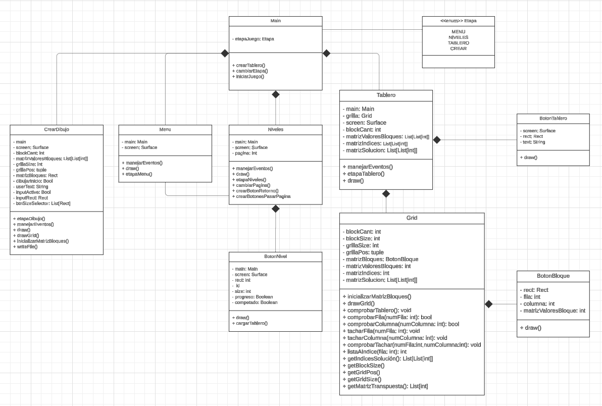

# Nonogram

Este proyecto es un juego de Nonogram, el objetivo principal del proyecto es crear un tablero interactivo donde los jugadores deben resolver un puzle basándose en las pistas numéricas proporcionadas, que indican cuántos bloques deben ser marcados en cada fila y columna. También posee una variedad de niveles de distintos tamaños que son accedidos a través de la interfaz gráfica.  

## Requisitos

- **Lenguaje de programación:** Python.
- **Biblioteca:** Pygame.
- **Sistema operativo:** Funciona en cualquier sistema operativo con Python y Pygame (Windows, Linux, macOS). 

## Uso

Para ejecutar el juego abrir el archivo: __*main.py*__

Al iniciar el juego, se presentará un menú donde puedes seleccionar diferentes niveles o crear tu propio puzle.
Las celdas se pueden marcar haciendo clic izquierdo y tacharse con clic derecho.
El juego verifica si el puzle está completo automáticamente.

## uml

[UML Nonogram](https://lucid.app/lucidchart/eee06729-f13f-48ba-8494-0fed7540034d/edit?viewport_loc=510%2C10%2C3169%2C1623%2CHWEp-vi-RSFO&invitationId=inv_c5365d41-b2af-44b4-a6f5-0860fdcba8db)

### Número de grupo: 17

### Integrantes: 

- Ariel Eduardo Cisternas Bustos
- María José San Martín Salgado
- Valeria Quiroga Carrere 